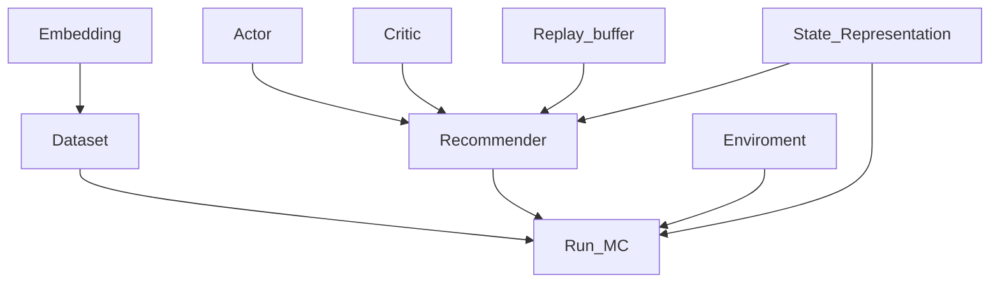
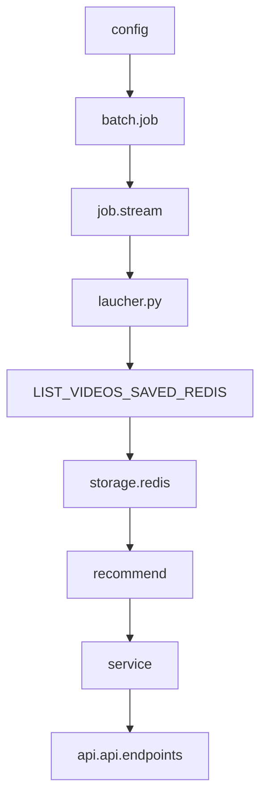

# HANOI

## :banana: Table of contents
1. [How many branches do we have?](#Howmanybranchesdowehave)
2. [Code flow](#Codeflow)
3. [Note in each version](#Noteineachversion)

************

  

## :cactus: Project hanoi include 3 main branches

*  **DEV_TUANNM** : developing stage on local
*  **DEV** : save final code on versions when push to remote/server 
* **MAIN** : final code to push production/server
***********

## :cactus: Code flow

* **Embedding** 
    * Embedding has responsibled about create file embedded the relationship between video - user - genre
    * It has: 
        - m_g_model_weights.weights.h5
        - u_m_model_weights.weights.h5 
        - user_movie_embedding)case4.h5
* **Dataset**
    * Dataset has responsibiled about create input to model from data source (history_log - video - category)
    * It has: 
        - Encoding_users: label encoding user_id to small number (ie: 230945985 -> 1, 435984304 -> 2 ...). Representing user_id under matrix types were making a few trouple to system (ram), which limited capacity of calculation.
        - Encoding_videos: have the same problems with above.
        - User_dict: History of each users which have list interactived videos.
        - Users_history_len_local: Lenght history interactived videos of users
* **Recommender**
    * Recommender ~ The Agent, which has reponsibled to decide to interact with enviroment.
    * Two componet work into The Agent:
        - Actor
        - Critic
        - Replay_buffer 
        - State_Representation
* **Enviroment**
    * Create step reward to respond Agent in two case good or bad

  

## :cactus: Note in each version  

**`1. OLD SYSTEM`**
* All packages store in Asset folder but Run_MC, Run_MC become Job_create_next_video (in batch job)  

**`2. NEW SYSTEM`**
* Dataset become Job_create_dataset (in batch job)
* Run_MC become Job_serving_next_video (in stream job)

* Flow: config => batch.job => job.stream => laucher.py => storage.redis => recommend => service => api.api_v1.enpoints

